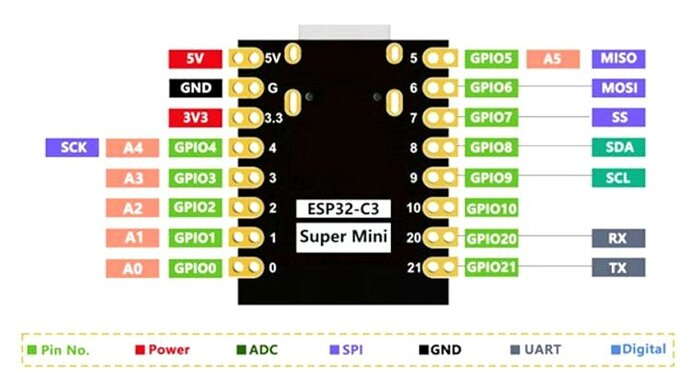
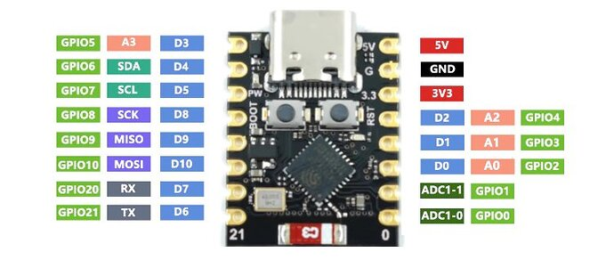

# ESP32-C3 Modbus Motor Control (v1.0)

This project allows controlling a motor driver via Modbus RTU protocol using an ESP32-C3 SuperMini microcontroller. It features digital inputs for physical controls and a local web interface configured as an Access Point (AP).

## 🔌 ESP32-C3 + MAX485 (Modbus RTU) Connection
The MAX485 module (TTL ↔ RS485) plays the vital role of converting the ESP32's UART communication into a robust differential signal for the RS485 bus.

### 📐 Connections

🔹 **ESP32-C3 → MAX485**

| ESP32-C3 | MAX485 | Description |
| :--- | :--- | :--- |
| **3.3V** | **VCC** | Power |
| **GND** | **GND** | Ground |
| **TX (GPIO 21)** | **DI** | Data to transmit |
| **RX (GPIO 20)** | **RO** | Data received |
| **GPIO 10** | **DE + RE** | Direction control |

**🔁 KEY Point: DE and RE**
On the MAX485 module:
- **DE** (Driver Enable) → Enables transmission.
- **RE** (Receiver Enable) → Enables reception (active LOW, meaning its logic value is inverted).

👉 **What is done in practice:**
The DE and RE pins are physically tied together.
```text
DE ─┬─ GPIO 10 (PIN_DE_RE)
    └─ RE
```

**🔄 Operating Logic (Direction Control)**
| GPIO 10 | MAX485 Mode |
| :--- | :--- |
| **LOW** | Reception (`Serial1.read`) |
| **HIGH** | Transmission (`Serial1.write`) |

In our code, `HIGH`/`LOW` control of this pin is handled automatically by the `ModbusMaster` library via the `node.preTransmission()` and `node.postTransmission()` functions in `src/main.cpp`.

🔹 **Connection to driver (RS485)**
| MAX485 | Motor Driver |
| :--- | :--- |
| **A** | **A** (Data +) |
| **B** | **B** (Data -) |

> 👉 **If the system does not communicate:** Try **swapping** A and B on the driver terminals. This is the most common RS-485 issue.

### 📊 Full Connection Diagram
```text
        +-------------------+
        |     ESP32-C3      |
        |                   |
        |   TX (21) --> DI  |
        |   RX (20) <-- RO  |
        |   GPIO 10 --> DE/RE
        +--------|----------+
                 |
          +------v------+
          |   MAX485    |
          |             |
          |   A -------+------------------> A (Driver)
          |   B -------+------------------> B (Driver)
          +-------------+
```

### ⚠️ Powering (VERY important)
Many generic MAX485 modules state 5V, but in practice they can work with 3.3V, or they strictly require 5V.
👉 **The ideal setup:**
- If the module has a regulator and supports 3.3V logic, power it with the 3.3V output from the ESP32.
- **⚠️ If the module is strictly 5V but your ESP32 TTL logic handles 3.3V:** You might need a _Level Shifter_ on the TX and RX lines to protect the ESP32 chip (C3 pins generally tolerate up to supply voltage, 3.3V, and 5V could burn them, especially via the path from `RO` to the ESP32). Check the exact specifications of the MAX485 hardware version you are using.

### ⚙️ UART Configuration in Firmware
In `src/main.cpp` we configure the serial bus via `Serial1` using the specific C3 pins:
```cpp
Serial1.begin(modbusBaudrate, SERIAL_8N1, PIN_RX, PIN_TX);
```

### ⚠️ Best Practices
1. **Termination (if cable is long):** 120Ω resistor between A and B terminals at the end of the line.
2. **Common ground:** Always connect GND of the ESP32+MAX485 circuit with the indicated GND terminal of the Motor Driver, to establish an identical reference potential.
3. **Cable:** Use twisted pair cable (e.g. UTP Cat5/6 for networking) for A and B; this greatly reduces induced noise.

---

### 🚀 Short summary for quick assembly

✔️ **TX (21)** → DI  
✔️ **RX (20)** → RO  
✔️ **GPIO (10)** → DE + RE (tied together)  
✔️ **A/B** → A/B driver terminals  
✔️ **HIGH** = transmit / **LOW** = receive (Managed automatically by software)

### 📸 Reference Pinouts

**ESP32-C3 SuperMini Pinout:**


**MAX485 Pinout:**

